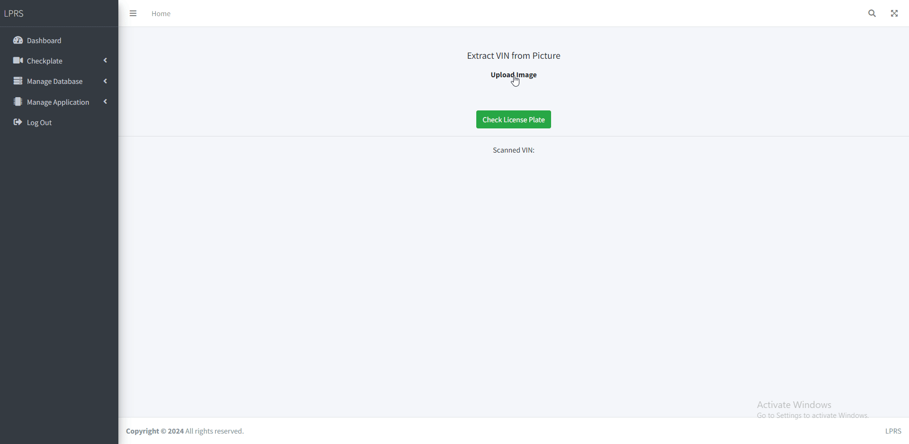
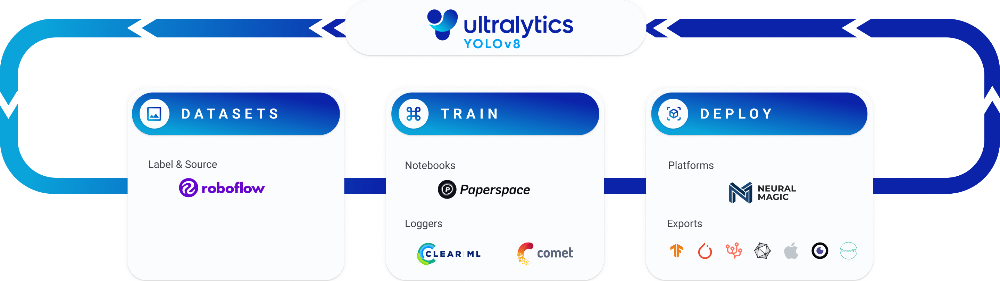

## Application Demonstration


## Frameworks and technologies used

| Python | Django |
|----------|----------|
|      |    |


| OpenCV | Tesseract OCR |
|----------|----------|
|      |    |


| YOLO V8 Machine Learning Architecture from Ultralytics |
|--------------------------------------------------------|
|    |


We use YOLOv8 from Ultralytics Ltd. to train the provided datasets, validate, test and deploy the the Trained Model and saved the model as "best.pt". 

Here is the code for training the Datasets of Bangla Licenseplates
```python
from ultralytics import YOLO

# Load a model
model = YOLO("yolov8n.yaml")  # build a new model from scratch

# Use the model
results = model.train(data="/content/Bangladeshi-license-plate-1/data.yaml", epochs=100)  # train the model
```

## Python Code Detecting License Plate from the Picture using saved Trained Model and extract text using PyTesseract
```python
import re
import pytesseract
import cv2
import numpy as np

from ultralytics import YOLO

# Load Pre Trained model using YOLO method from ultralytics 
license_plate_detector = YOLO(str(settings.BASE_DIR)+'\\myapp\\'+'best.pt')

    # Load image frame using cv2
    frame = cv2.imread(str(settings.MEDIA_ROOT)+'\\'+name)
    results = license_plate_detector(frame)

    # Iterate through all the detected plates
    for i in range(0, len(results[0].boxes.xyxy)):
        # Map all the bounding box's co-ordinates
        x1, y1, x2, y2 = map(int, results[0].boxes.xyxy.tolist()[i])
        
        # Crop the image only the licenseplate area
        cropped_plate = frame[y1:y2, x1:x2]

        # Make the cropped frame to gray
        gray = cv2.cvtColor(cropped_plate, cv2.COLOR_BGR2GRAY)

        # Preprocess the image by bluring highlight the text regions
        gray = cv2.medianBlur(gray, 5)

    
    
    
        # Extracting all the Text From the Image Frame as Bangla and Parse it to the Data Frame/ Dictionary
        data_with_conf = pytesseract.image_to_data(gray, lang='ben', config='--psm 6', output_type=pytesseract.Output.DICT)
        
        # Extracting all the Text From the Image Frame as Bangla and Parse it to the String
        data = pytesseract.image_to_string(gray, lang='ben', config='--psm 6')
        print(data)

        # Iterate through each word in the data
        for i in range(len(data_with_conf['text'])):
            if int(data_with_conf['conf'][i]) > -1:  # Checking if the confidence is valid
                text = data_with_conf['text'][i]
                conf = data_with_conf['conf'][i]
                
                # Using the RegEX to filter to bangla letters
                pattern = r'[\u0985-\u09B9\u09BC-\u09C4\u09C7-\u09CE\u09D7\u09DC-\u09E3]+'
                letters = re.findall(pattern, text)
                
                # Using the RegEX to filter to bangla numbers
                numbers = re.findall("[০১২৩৪৫৬৭৮৯]*", text)
                try:
                    print('Bangla Letters in Eng:', districts_bd[f'{letters}'])
                except:
                    print('Bangla Letters:', letters)
                print('Bangla Numbers:', numbers)
                print(f"Detected text: {text} - Confidence: {conf}")

```


## Deployed Demo Web Application
To check the site go to https://lprts.onrender.com/

Username and Password


| Username | Password |
|----------|----------|
|  arif  |  1830398  |
|  asif  |  1831066  |
|  farhan  |  1810615  |
|  shibriat  |  1831099  |


## Top Contributors
| Student ID | Student Name |
|----------|----------|
|  1830398  |  S.M. Arif Mahmud  |
|  1831099  |  Shibriat Hossain  |
|  1831066  |  Ahmad Asif Arifeen  |
|  1810615  |  S.M. Farhan Ishrak  |


